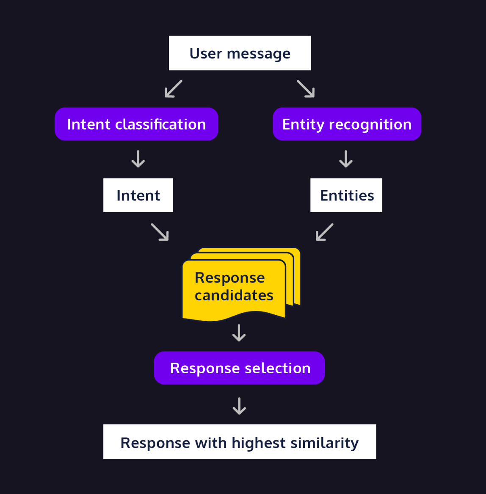

# Retrival Based ChatBot
Simple Closed Domain ChatBot, designed to answer 10 most common Questions. 

## Table of Contents
- Installation
- Usage
- Contributing
- License

## Installation
- import pandas as pd
- from collections import Counter
- from nltk.stem import WordNetLemmatizer
- import nltk
- from nltk.tokenize import word_tokenize
- from nltk.corpus import stopwords, wordnet
- from nltk.stem.porter import PorterStemmer
- from sklearn.feature_extraction.text import TfidfVectorizer
- from sklearn.metrics.pairwise import cosine_similarity
- !python -m spacy download en_core_web_sm

## Usage

1. User Sends Message.
   2. Optional Route to verify user, not deployed. 
2. Bag of Word model assess what Category the Question falls into (Plans, Sign-Up, Log-in, Sub-Accounts)
3. Tf-idf model assess the intent (or specific Question) user is asking
4. Appropriate response to user sent

### Layout

